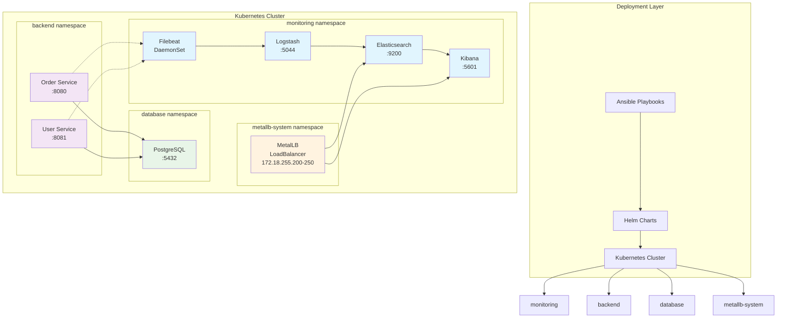
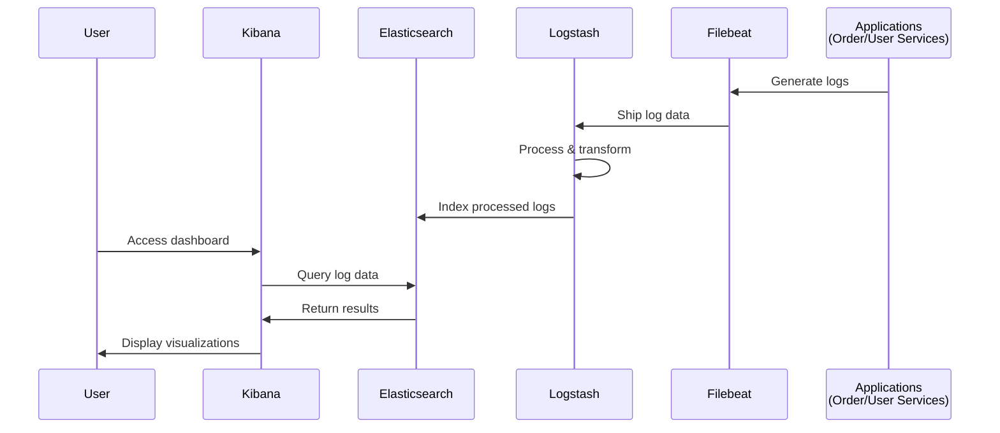

# Kubernetes ELK Stack Platform

Production logging infrastructure with microservices using Helm, Ansible, and Kubespray.

## Quick Start

```bash
make setup    # Create cluster
make deploy   # Deploy ELK stack and services
make status   # Check deployment status
make kibana   # Access Kibana at http://localhost:5601
```

## Architecture



### Data Flow



## Project Structure

```text
helm-charts/charts/
├── elasticsearch/     # Search and analytics engine
├── kibana/           # Data visualization dashboard
├── logstash/         # Log processing pipeline
├── filebeat/         # Log data shipper
├── metallb/          # Load balancer configuration
└── services/         # Application services
    ├── order-service/  # Order management API
    ├── user-service/   # User management API
    └── postgres/       # PostgreSQL database

playbooks/                 # Ansible deployment automation
├── main.yml              # Main orchestration playbook
└── tasks/
    ├── deploy-helm.yml   # Deploy all Helm charts
    ├── remove-helm.yml   # Remove all deployments
    └── validate-cluster.yml # Validate cluster state

inventory/mycluster/       # Kubespray cluster configuration
scripts/                   # Utility scripts
```

## Prerequisites

- Kubernetes 1.20+
- Helm 3.x
- Ansible 2.9+
- kubectl configured

## Deployment

```bash
# Complete deployment
make setup && make deploy

# Deploy using Ansible directly
ansible-playbook playbooks/main.yml -e action=deploy

# Deploy specific components
ansible-playbook playbooks/main.yml -e action=deploy \
  -e deploy_postgres=true \
  -e deploy_order_service=true
```

## Verification

```bash
make status   # Check deployment status
make kibana   # Access Kibana interface
```

## Operations

```bash
# Access services
make kibana           # Port-forward to Kibana (5601)

# Management
make remove           # Remove deployments
make clean            # Delete cluster

# Generate test data
make generate-logs    # Generate sample log entries
```

## Services

| Service | Namespace | Port | Access |
|---------|-----------|------|--------|
| Elasticsearch | monitoring | 9200 | LoadBalancer |
| Kibana | monitoring | 5601 | LoadBalancer |
| Logstash | monitoring | 5044, 9600 | ClusterIP |
| Filebeat | monitoring | - | DaemonSet |
| PostgreSQL | database | 5432 | ClusterIP |
| Order Service | backend | 8080 | ClusterIP |
| User Service | backend | 8081 | ClusterIP |

## Troubleshooting

```bash
# Check deployment status
kubectl get pods -A
kubectl get svc -A

# View component logs
kubectl logs -n monitoring deployment/elasticsearch
kubectl logs -n monitoring deployment/kibana

# Test connectivity
kubectl exec -it -n monitoring deployment/elasticsearch -- curl http://localhost:9200
```
